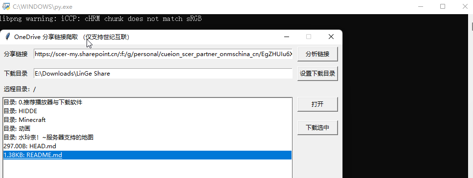

OneDrive 分享链接下载器，仅支持世纪互联的分享链接。

链接示例：[https://scer-my.sharepoint.cn/:f:/g/personal/cueion_scer_partner_onmschina_cn/EgZHUIu6XgdFtRErCg7wAXUB2kP5aBaCKT9kGOUnSwnAbQ](https://scer-my.sharepoint.cn/:f:/g/personal/cueion_scer_partner_onmschina_cn/EgZHUIu6XgdFtRErCg7wAXUB2kP5aBaCKT9kGOUnSwnAbQ)

因为 OneDrive 的文件分享页没有提供下载多个文件和下载整个文件夹的功能，在文件较多时对于下载者很不友好。

这个小程序可以爬取 OneDrive 分享链接里的文件信息，一次可以下载多个文件和文件夹。下载是通过命令行调用 aria2c 完成的，下载速度很快，并且可以断点续传。

使用方法请参考：[https://lin515.com/archives/110.html](https://lin515.com/archives/110.html)

